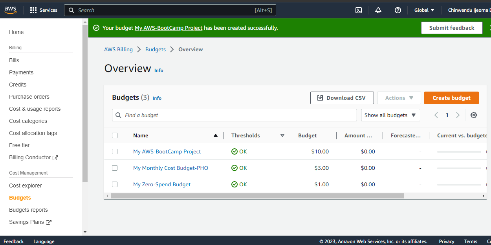
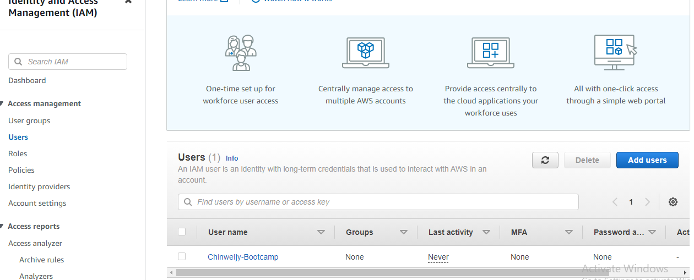
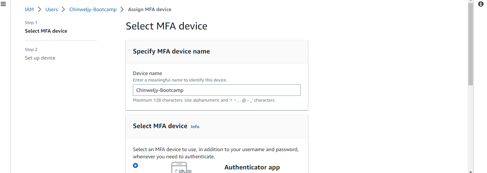
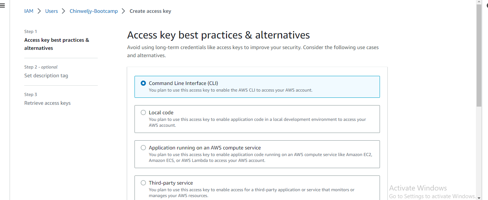

# Week 0 — Billing and Architecture

## Napkin Design
* I was able to use a cardboard paper and marker to construct a napkin design to show the concept of the ephemeral-first micro-blogging platform to be built.
* 

## Logical Architectural Design Creation
* As the first task, I also navigated using Lucid Chart to create it a shown below. Locked and to be viewed only.

 
 
# Billing, Budget Cost Explorer and Billing Alarm
* As the first task to do which is done with my Root User account, I was able to create a zero-spend budget.
* I setup a Billing alarm which an alert was sent via email notification and this helps in Cost Management.
* This is to help track spending while provisioning and deploying resources.

# Creating a IAM User, and MFA
* I created a User to enable me stop using my Root account, added a MFA and granted the User Administrative access.
 

## Installing CLI
* I installed CLI via Command Prompt as I could not navigate using gitpod despite the fact I was able to install the chrome extension on my browser.
* It is shown below.

### I read through AWS's well-architected framework which include:
* Operational Excellence
* Security Pillar
* Reliability Pillar
* Performance Efficiency
* Cost Optimization
* Sustainability
### I was able to read through all of them.

# Launch Cloudshell
* I was able to launch Cloudshell although I did not use it

